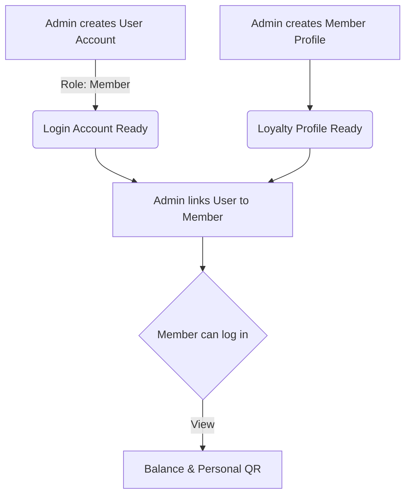
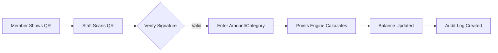

# QR-Based Loyalty Points System

A production-ready, security-first loyalty system designed for financial cooperatives. This system enables secure point accumulation and reward redemption via HMAC-signed QR codes.

---

## 🚀 Quick Start

### 1. Backend Setup (Laravel)
```bash
cd loyaltysystem-backend
composer install
cp .env.example .env     # Configure DB_DATABASE, JWT_SECRET, and QR_SECRET
php artisan key:generate
php artisan migrate --seed
php artisan serve
```

### 2. Frontend Setup (React)
```bash
cd loyaltysystem-frontend
npm install
cp .env.example .env     # Update VITE_API_BASE_URL
npm run dev
```

---

## 🛠 Features & Capabilities

### 🔒 Security-First Design
- **HMAC Signatures**: QR codes are cryptographically signed to prevent tampering.
- **RBAC**: Role-Based Access Control for Admins, Staff, and Members.
- **Audit Trails**: Immutable logs for every critical system action.
- **Fraud Engine**: Integrated scoring to detect suspicious point accumulation.

### 💰 Points Engine
- **Dynamic Rules**: Define rules like "1 Point per 100 PHP Deposit".
- **Category Based**: Different earning rates for Loans, Deposits, and Attendance.
- **Real-time Balance**: Instant point updates upon transaction confirmation.

---

## 🗺 System Workflows

### 🛡 Member Enrollment & Linking


### 📲 QR Transaction Flow


---

## 📂 Project Architecture

### Component Hierarchy
- `loyaltysystem-backend/`: API infrastructure, Security services, Points logic.
- `loyaltysystem-frontend/`: 
  - `/admin`: Dashboard, Analytics, Manager (Rules, Users, Members).
  - `/staff`: QR Scanner and Transaction terminal.
  - `/member`: Balance view, QR display, Rewards catalog.

---

## 📡 API Endpoints (V1)

| Method | Endpoint | Description | Access |
| :--- | :--- | :--- | :--- |
| `POST` | `/auth/login` | User authentication | Public |
| `GET` | `/dashboard/stats` | System analytics | Admin |
| `POST` | `/scan` | Process points transaction | Staff/Admin |
| `GET` | `/members/{id}/qr` | Get signed QR payload | Owner/Staff/Admin |
| `GET` | `/audit-logs` | View activity history | Admin |

---

## 📄 Documentation
For detailed technical implementation details, security logic, and database schema, please refer to:
- [Technical Documentation](TECHNICAL_DOCUMENTATION.md)
- [Backend Structure](loyaltysystem-backend/README.md)

---

## 🤝 Support
Developed by ICT Department. For issues, please contact system administration.
